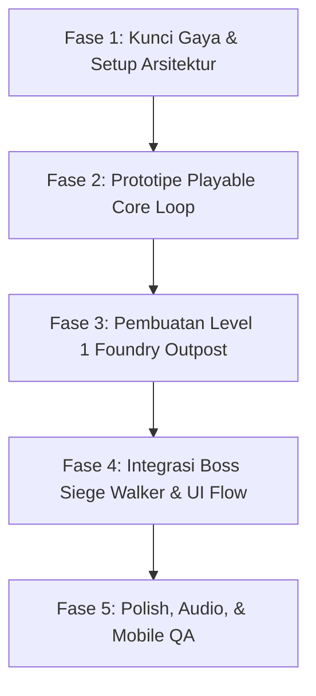

# DEVELOPMENT ROADMAP & AGENT WORKFLOW

## 1. Pembagian Peran AI Agent

### 🤖 Developer Agent (Flutter / Flame Engineer)
- **Tanggung Jawab:**
  - Setup Flutter & Flame engine, konfigurasi viewport fixed resolution `640 × 360`, dan landscape orientation lock.
  - Implementasi kontrol mobile (Virtual Joystick / D-Pad, Jump, Shoot buttons) serta keyboard fallback untuk desktop testing.
  - Fisika karakter (run, jump, gravity, fall, collision).
  - Sistem senjata pemain, firing rate, bullet pooling, dan hit reaction.
  - Kecerdasan buatan (AI) musuh (Patrol Bot, Hover Drone, Turret) dan Boss state machine (Siege Walker).
  - Sistem level parsing (Tiled/Tilemap loader, parallax background scrolling, camera follow).
  - In-game HUD, Game Over, Win Screen, Pause Menu, dan Audio Manager.
  - Integrasi animasi sprite berbasis manifest JSON dan fallback placeholder rendering.

### 🎨 Asset Artist Agent (Pixel Art & Visuals)
- **Tanggung Jawab:**
  - Menetapkan & menjaga konsistensi arah visual pixel art dan palet warna 7-warna resmi.
  - Memproduksi sprite sheet animasi Player, 3 Musuh, dan Boss Siege Walker sesuai ukuran kanvas standar.
  - Mendesain tileset modular `32 × 32 px` untuk lingkungan Foundry Outpost.
  - Mendesain 3 lapisan latar belakang (Parallax Background Layers) dengan seamless horizontal looping.
  - Memproduksi visual FX (peluru cyan/oranye, muzzle flash, percikan ledakan, debu).
  - Membuat aset UI (ikon HUD, frame panel, virtual button icons, game title logo).
  - Menyediakan file JSON manifest untuk setiap animasi.

---

## 2. Tahapan Pengerjaan (Phases 1–5)

---

### 🔹 Fase 1 — Kunci Gaya & Fondasi Proyek
- [x] Dokumentasi Proyek (`AGENTS.md`, `GDD.md`, `TECHNICAL_SPEC.md`, `ASSET_GUIDELINES.md`, `ROADMAP.md`).
- [ ] Inisialisasi dependensi `flame` & `flame_audio` di `pubspec.yaml`.
- [ ] Setup konfigurasi dasar `IronFrontierGame` dengan viewport `640 × 360` dan landscape lock.
- [ ] **Artist:** Produksi Style Definitive Pack (Desain Player, Patrol Bot, Sample Tileset, dan 1 Mockup adegan).

---

### 🔹 Fase 2 — Prototipe Playable (Core Mechanics)
- [ ] **Developer:**
  - Implementasi kontrol touch & keyboard (A/D/Panah + Spasi + J/K).
  - Karakter player dengan state machine (Idle, Run, Jump, Fall, Shoot, Hurt, Death) menggunakan placeholder box.
  - Sistem penembakan proyektil horizontal & autofire timer.
  - Implementasi Patrol Bot pertama dengan patrol movement dan deteksi tembakan.
  - Sistem collision dasar (Player, Platform, Bullet, Enemy).
- [ ] **Artist:**
  - Animasi Sprite Player (`idle`, `run`, `jump`, `shoot`, `hurt`, `death`).
  - Animasi Sprite Patrol Bot & FX peluru / ledakan kecil.
  - Manifest JSON untuk Player dan Patrol Bot.

---

### 🔹 Fase 3 — Level 1: Foundry Outpost
- [ ] **Developer:**
  - Implementasi Hover Drone (gerakan sinusoidal & tembakan berkala).
  - Implementasi Defense Turret (fase charge & burst fire).
  - Pembangunan 5 segmen level Foundry Outpost dengan tilemap.
  - Multi-layer Parallax Background scrolling mengikuti kamera.
  - Hazard zone (acid/fall pit respawn).
- [ ] **Artist:**
  - Animasi Sprite Hover Drone & Defense Turret.
  - Foundry Tileset lengkap (`32 × 32 px`).
  - 3 Lapisan Parallax Background (Sky/City, Mid Industrial, Near Truss).

---

### 🔹 Fase 4 — Boss Siege Walker & Menu Flow
- [ ] **Developer:**
  - Boss State Machine: Phase 1 (Horizontal Barrage) ➔ Phase 2 (Spread Volley) ➔ Cooldown Phase (Exposed Weakpoint) ➔ Death Explosion sequence.
  - Arena Lock: Kamera mengunci saat memasuki Siege Arena.
  - In-Game HUD: 3 HP icon pemain & Boss HP Bar dinamis.
  - Layar UI: Main Menu, Pause Dialog, Game Over (dengan tombol Retry), dan Victory Screen.
- [ ] **Artist:**
  - Animasi Sprite Siege Walker (`160 × 128 px`).
  - FX Ledakan Besar (Boss death) & Spark tebal.
  - UI Assets: Title Logo, Health Icon, Boss Bar Frame, Button Sprites.

---

### 🔹 Fase 5 — Polish, Audio, & Optimasi Android
- [ ] Integrasi efek suara (SFX) dan latar musik (BGM).
- [ ] Screen shake halus saat boss meledak atau terkena damage besar.
- [ ] Pengujian performa Android (60 FPS stabil, touch input response time < 16ms).
- [ ] Verifikasi visual: Tepi pixel tajam (Nearest-neighbor), tidak ada celah antar tile.

---

## 3. Kriteria Selesai Versi 1 (Definition of Done)

Versi 1 dinyatakan **SELESAI** dan siap rilis jika:
1. **Full Playable Loop:** Pemain dapat memulai dari Main Menu, menjelajahi seluruh level Foundry Outpost, bertarung melawan musuh, mengalahkan Siege Walker, dan melihat Victory Screen tanpa crash.
2. **Smooth Mobile Controls:** Kontrol virtual di layar responsif pada perangkat Android landscape.
3. **Penyajian Visual Konsisten:** Semua sprite menggunakan palet warna resmi, pixel grid 1:1 tanpa antialiasing buram, dan titik pijak kaki karakter tidak melayang/tenggelam.
4. **Readability:** Peluru pemain (cyan) dan musuh (oranye) langsung terbaca dengan jelas terhadap latar belakang.
5. **State Management:** Tombol Pause, Game Over, Restart, dan Victory berfungsi dengan transisi yang rapi.
